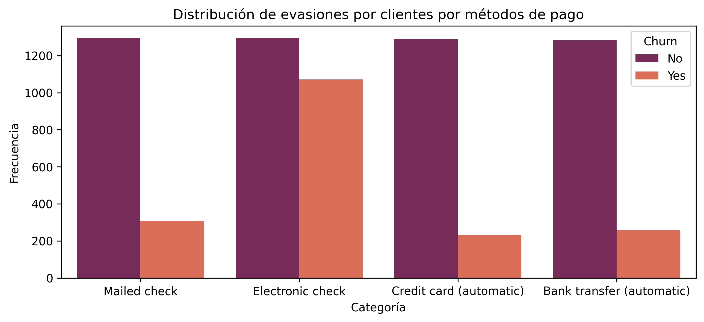
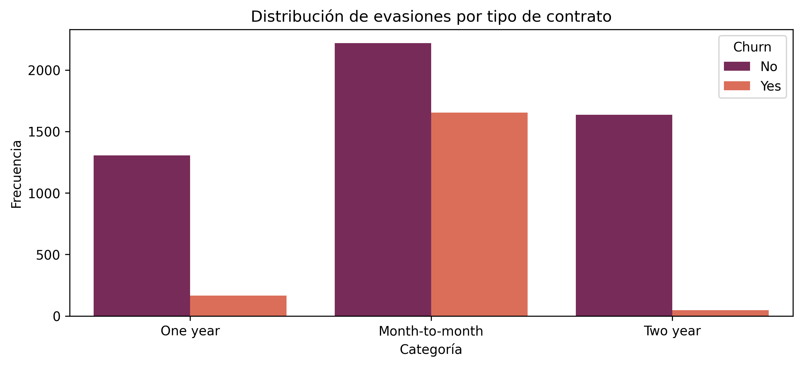

# Segundo Challenge de Especialización de Data Science de Oracle y Alura

----------------------------  

# Índice
- [1.Instalación](#1-Instalación)
- [2.Descripción](#2-Descripción)
- [3.Estructura del proyecto y organización de los archivos](#3-Estructura-del-proyecto-y-organización-de-los-archivos)
- [4.Ejemplos de gráficos e insights obtenidos](#4-Ejemplos-de-gráficos-e-insights-obtenidos)
- [5.Instrucciones para ejecutar el notebook](#5-Instrucciones-para-ejecutar-el-notebook)
----------------------------               

# 1. Instalación
Sigue a continuación los siguientes comandos:

```bash
# Clona este repositorio
git clone https://github.com/PedroB6/ChallengeTelecomX_AluraOracle

# Entra en el directorio del proyecto
cd ChallengeTelecomX_AluraOracle

```

# 2. Descripción


Dado que la empresa enfrenta una alta tasa de cancelaciones, se necesita comprender los factores que llevan a la pérdida de clientes. El desafío consiste en recopilar, procesar y analizar los datos, utilizando Python y sus principales bibliotecas para extraer información valiosa.

# 3. Estructura del proyecto y organización de los archivos

1. Con la librería de pandas se leen en el Google Colab los archivos CSV que contienen información de las 4 tiendas en 4 archivos diferentes.
2. Se comprendió la información que contiene cada columna, para entender los datos.
3. Se generaron algunos gráficos de interés.

# 4. Ejemplos de gráficos e insights obtenidos

Distribuido en clientes que abandonaron o no, como se dividió por tipo de contrato


Distribuido en clientes que abandonaron o no, como se dividió por método de pago



# 5. Instrucciones para ejecutar el notebook

Subir al Google Colab personal, la copia del archivo con extensión ".ipynb" y ejecutar las celdas.
